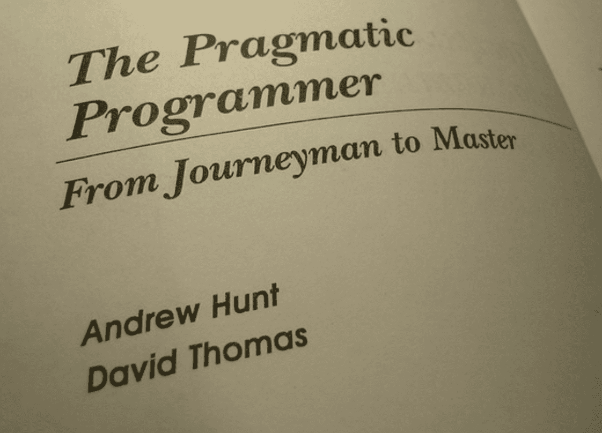
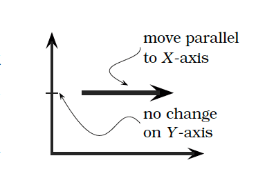

## 2.8. Orthogonality

> What Is Orthogonality?
>
>> In computing, the term has come to signify a kind of independence or decoupling. Two or more things are orthogonal if changes in one do not affect any of the others. In a well-designed system, the database code will be orthogonal to the user interface: you can change the interface without affecting the database, and swap databases without changing the interface.
>
> ~ page: 34

> 2.13. Estimating
>
>> All estimates are based on models of the problem. But before we get too deeply into the techniques of building models, we have to mention a basic estimating trick that always gives good answers: ask someonewho’s already done it.
>
>~ page: 65

## 4. Pragmatic Paranoia

>> But Pragmatic Programmers take this a step further. They don’t trust themselves, either. Knowing that no one writes perfect code, including themselves, Pragmatic Programmers code in defenses against their own mistakes. We describe the first defensive measure in Design by Contract: clients and suppliers must agree on rights and responsibilities.
>
> ~ page: 108

> 4.21. Design by Contract
>
>> What is a correct program? One that does no more and no less than it claims to do. Documenting and verifying that claim is the heart of Design by contract(DBC, for short).
>
> ~ page: 109

>> Subclasses must be usable through the base class interface without the need for the user to know the difference.
>> 
>> In other words, you want to make sure that the new subtype you have created really “is-a-kind-of” the base type—that it supports the same methods, and that the methods have the same meaning.
>
> ~ page: 112

> 4.24. When to Use Exceptions
>
>> What Is Exceptional?
>>
>> “Will this code still run if I remove all the exception handlers?” If the answer is “no,” then maybe exceptions are being used in nonexceptional circumstances.
>
> ~ page 126

> 4.25. How to Balance Resources?
>
>> It doesn’t matter what kind of resources we’re using—transactions,memory, files, threads, windows—the basic pattern applies: whoever allocates a resource should be responsible for deallocating it. However,in some languages we can develop the concept further.
>
> ~ page: 131

## 6. While You Are Coding

> 6.31 Programming by Coincidence</h4>
>
>> How to Program by Coincidence</h4>
>>
>> Suppose Fred is given a programming assignment. Fred types in some code, tries it, and it seems to work. Fred types in some more code, tries it, and it still seems to work. After several weeks of coding this way, the program suddenly stops working, and after hours of trying to fix it, he still doesn’t know why. Fred may well spend a significant amount of time chasing this piece of code around without ever being able to fix it. No matter what he does, it just doesn’t ever seem to work right.
>>
>>Fred doesn’t know why the code is failing because he didn’t know why it worked in the first place. It seemed to work, given the limited “testing” that Fred did, but that was just a coincidence. Buoyed by false confidence, Fred charged ahead into oblivion. Now, most intelligent people may know someone like Fred, but we know better. We don’t rely on coincidences—do we?
>>
>>Sometimes we might. Sometimes it can be pretty easy to confuse a happy coincidence with a purposeful plan.
>
> ~ page: 173

> Implicit Assumptions
>
>> Coincidences can mislead at all levels—from generating requirements through to testing. Testing is particularly fraught with false causalities and coincidental outcomes. It’s easy to assume that X causes Y, but as we said in Debugging, page 90: don’t assume it, prove it.
>
> ~ page: 174

> How to Program Deliberately
>
>> * Always be aware of what you are doing.
>> * Don’t code blindfolded.
>> * Proceed from a plan, whether that plan is in your head, on the back of a cocktail napkin, or on a wall-sized printout from a CASE tool.
>> * Rely only on reliable things. Don’t depend on accidents or assumptions.
>> * Document your assumptions.
>> * Don’t just test your code, but test your assumptions as well. Don’t guess; actually try it.
>> * Prioritize your effort.
>> Don’t be a slave to history. Don’t let existing code dictate future code.
>
> ~ page: 175

> 6.33 Refactoring

> **TIP 47**
>
>> Refactor Early, Refactor Often
>
> ~ page: 186

> How Do You Refactor?
>
>> * Don’t try to refactor and add functionality at the same time. 
>> * Make sure you have good tests before you begin refactoring. Run the tests as often as possible. That way you will know quickly if your changes have broken anything.
>> * Take short, deliberate steps: move a field from one class to another, fuse two similar methods into a superclass. Refactoring often involves making many localized changes that result in a larger-scale change. If you keep your steps small, and test after each step, you will avoid prolonged debugging.
>
> ~ page: 186

## 8. Pragmatic Projects</h3>

> 8.43 Ruthless Testing
>
>> The earlier a bug is found, the cheaper it is to remedy. “Code a little, test a little” is a popular saying in the Smalltalk world
>
> ~ page: 238

> TIP 65
>
> Test State Coverage, Not Code Coverage

>
> ~ page: 245